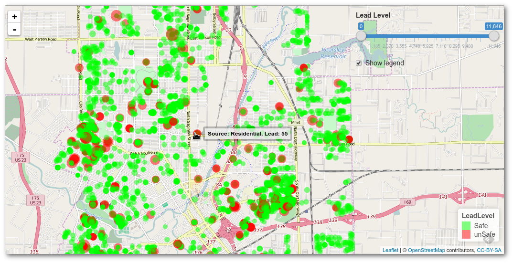

##Visualization dashboard for Michigan Flint Water Crisis ##

**Sean Ma, May 2016**

This is a visualization project done for the Michigan Data Science Team ([MDST](http://mdst.eecs.umich.edu/)) at the University of Michigan. We had the opportunity to collaborate with the City of Flint for their water crisis. Our goal is to provide data science skills to help translate data collected at the residential and city level into actionable insights. We hope this endeavor will benefit the residents at Flint in their journey to full recovery.

The code is in R Shiny ([link](http://shiny.rstudio.com/)) format and uses the _leaflet_ package ([link](http://rstudio.github.io/leaflet/)) heavily for map visualization.  

### News coverage: ###
- UM Record Press ([link](http://record.umich.edu/articles/google-u-m-build-digital-tools-flint-water-crisis))
- Gizmodo ([link](http://gizmodo.com/google-is-helping-flint-prioritize-which-lead-pipes-nee-1774517926))
- Chicago Tribune ([link](http://www.chicagotribune.com/bluesky/originals/ct-google-flint-water-data-bsi-20160503-story.html)) 
- WNEM TV5 ([link](http://www.wnem.com/story/31881735/google-donates-250000-to-help-bring-information-to-flint-residents))

### Todos: ###
- Separate Residential and Sentinel icons
- Add sliding time slider to indicate lead level change over time
- Incorporate service line data for visualization
- Add density line graphs on the side
- Add correlation graphs (year built vs lead level, etc.) on the side
- Add density plot as rastor layer
- Overlay Land Bank data as separate layer
- Overlay prediction model output as new layer 

